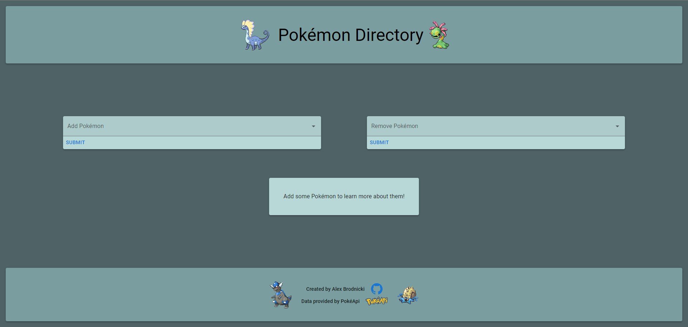
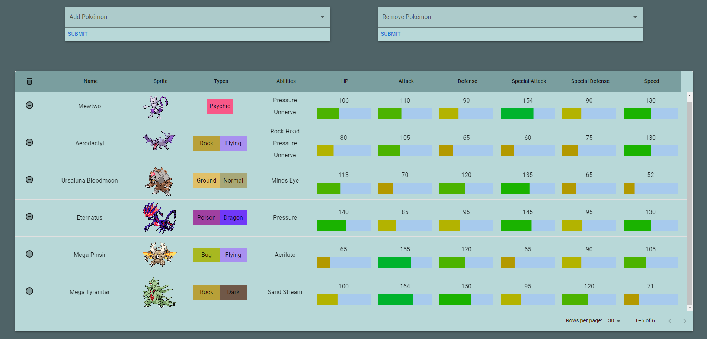
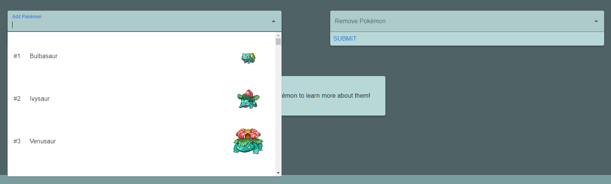
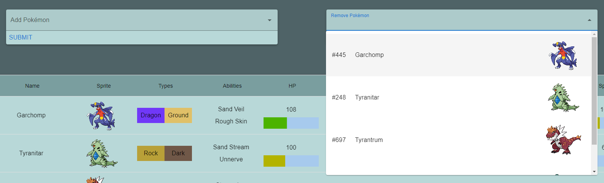

# Pokémon Directory
This is an application that showcases data about Pokémon.

The user can add or remove any existing Pokémon they want and will have their data saved in Local Storage.

The backend data is supplied by [PokéApi](https://pokeapi.co/).

It is hosted using Cloudflare Pages, you may view the website [here](https://apbrodnicki.com/pokemon-directory).

___
*Pokémon Directory was created by Alex Brodnicki.*
